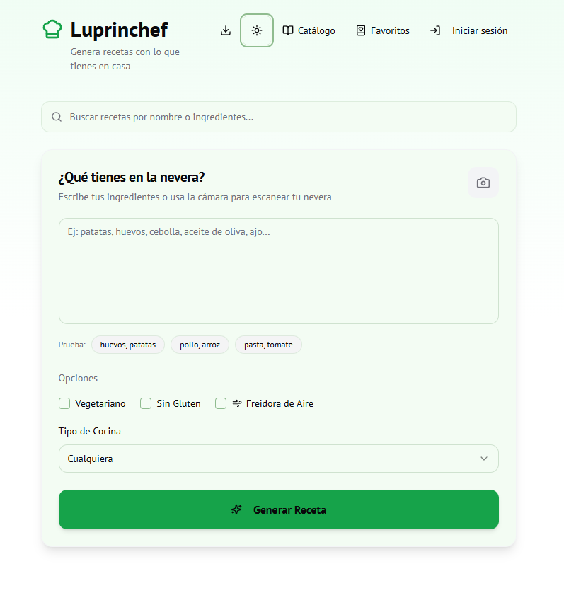
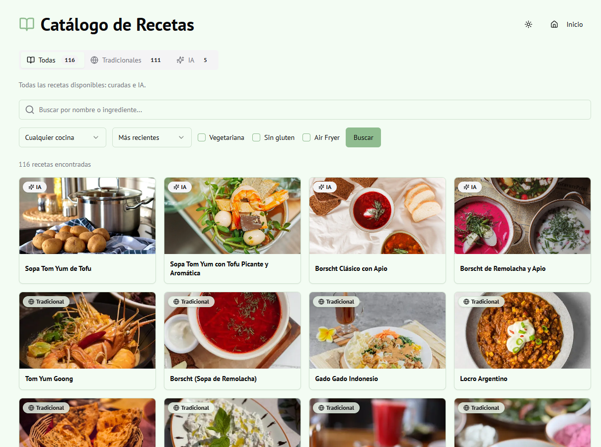

# 👨‍🍳 Luprinchef (Chef de la Nevera)

  
  
  
  
  
  
  

**Luprinchef** (Chef de la Nevera) es una aplicación web inteligente diseñada para ayudarte a encontrar y crear recetas basadas en los ingredientes que ya tienes en casa. Ya sea escribiendo lo que tienes o escaneando el interior de tu nevera con la cámara de tu dispositivo, la app te sugerirá la comida perfecta, aprovechando al máximo tus alimentos y ayudando a evitar el desperdicio.

##  Previews

  

  

## ✨ Funcionalidades Principales

- 🤖 **Generación de Recetas con IA**: Introduce tus ingredientes y deja que la Inteligencia Artificial de Google (Gemini) cree una receta estructurada y completamente personalizada.
- 📸 **Escáner de Ingredientes por Cámara**: Apunta con la cámara de tu dispositivo a tu nevera o encimera; la aplicación identificará visualmente de forma automática los ingredientes disponibles.
- 🎨 **Filtros Adaptativos**: Ajusta tus preferencias buscando recetas vegetarianas, sin gluten, optimizadas para Freidora de Aire (Air Fryer) o según múltiples tipos de gastronomía (Española, Italiana, Mexicana, etc.).
- 🖼️ **Imágenes Realistas**: Integración inteligente con la API de Pexels, apoyada de un sistema propio de caché para mostrar espectaculares fotografías fidedignas de los platos obtenidos de la IA.
- 📚 **Catálogo de Recetas Comunitarias**: Explora una inmensa base de datos conjunta donde cada receta generada alimenta un catálogo global que incluye platos tanto tradicionales como concebidos por la IA.
- ❤️ **Gestión de Favoritos y Carpetas**: Inicia sesión de manera segura a través de Google para guardar tus recetas favoritas en tu perfil y organizarlas en cómodas carpetas personalizadas.
- 🔍 **Sugerencias y Combinación Dinámica**: Amplía y modifica tus recetas haciendo clic en ingredientes sugeridos, combinando lo que ya vas a cocinar con nuevas ideas de forma increíblemente fluida.
- 🌙 **Modo Claro / Oscuro**: Interfaz moderna, accesible y fluida que se adapta a las preferencias visuales de tu dispositivo.

## 🚀 Tecnologías y Stack

El proyecto ha sido diseñado y desarrollado desde cero para ser eficiente escalable, utilizando:

- **Frontend**: Next.js 15 (App Router), React 18, Tailwind CSS, utilidades de shadcn/ui y estado cliente/servidor.
- **Backend**: API Routes y Server Actions de Next.js.
- **Base de Datos**: SQLite (mediante el potente ORM Prisma).
- **Inteligencia Artificial**: Modelos vision y generativos de Google Gemini, integrados fácilmente y orquestados gracias al framework Firebase Genkit.
- **Autenticación**: Inicio de sesión social integrado de forma segura con NextAuth.js.
- **Medios Externos**: Pexels API para galerías gastronómicas.

## 💡 Propósito

Fomentar el aprovechamiento consciente de los alimentos, facilitar la planificación intuitiva de comidas y auxiliar a cualquier persona —especialmente a las que cuentan con pocos víveres en casa o carecen de inspiración— a lograr una cocina de supervivencia excepcionalmente sencilla, nutritiva y altamente atractiva.
